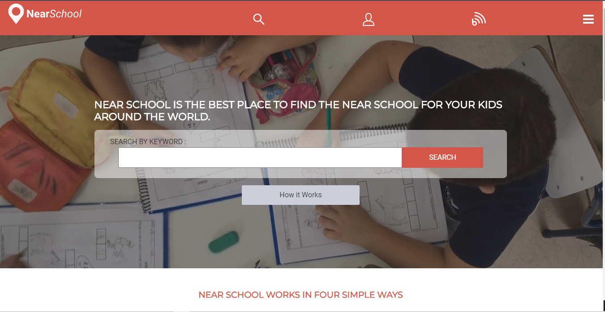

# Near School project
This project consists of me as a student from Microverse applying, everything I learned so far in HTML and CSS to recreate a design from real designers, adding some personal touch, and having the TSE as my client.

## This project includes the following features:

- Navigation Bar.
- A banner with a background video.
- Main section.
- Search page, Create an account, and sign-in page, and a page with the school details.
- Footer.

## Built With

- 
- 
-    
- 

## Live Demo

[Live Demo Link](https://helciodev.github.io/directory-of-schools/)

**See the page via the link above**

## Getting Started

To get a local copy of this repository up and running follow these simple steps:

### Prerequisites

- A PC or device with internet connection with the ability to use command line  or terminal.

### Setup

- Open the command line  or terminal

### Install

- Go to your preferred directory
- Run git clone git@github.com:helciodev/directory-of-schools.git command

### Usage

- Open index.html file in any modern browser

## Author

😎 **Helcio André**

- GitHub: [@helciodev](https://github.com/helciodev)
- Twitter: [@helcio_bruno](https://twitter.com/helcio_bruno)

## Show your support

Give a ⭐️ if you like this project!

## Acknowledgments

- Thanks to [Mathew Njuguna and others on Behance](https://www.behance.net/mathewnjuguna) for this[ the design](https://www.behance.net/gallery/25563385/PatashuleKE)
- icons used from [iconify](https://iconify.design/)
- Font Family  **Roboto and Montserrat** from [google fonts](https://fonts.google.com/)
- [Traversy Media](https://www.youtube.com/channel/UC29ju8bIPH5as8OGnQzwJyA) for a well done and straightforward tutorial on how to make a video background [video tutorial](https://www.youtube.com/watch?v=Xy3GlrddZFI&t=1002s)
- Images and video source in the website is [pexels ](https://www.pexels.com/) from authors [Adailton Batista](https://www.pexels.com/@adailtonbatista), [ Agung Pandit Wiguna ](https://www.pexels.com/@panditwiguna) [Julia M Cameron](https://www.pexels.com/@julia-m-cameron), [Matthis Volquardsen](https://www.pexels.com/@einfoto), [pixbay](https://www.pexels.com/@pixbay), [Meliani Idriss](https://www.pexels.com/@droosmo), [Deeana Creates](https://www.pexels.com/@deeanacreates)
-Intro on how to navigate [introJs](https://introjs.com/),
- The select tag with a list of all countries by [Exeideas](https://www.exeideas.com/2016/07/list-of-all-world-countries.html)
## 📝 License

This project is [MIT](https://choosealicense.com/licenses/mit/) licensed.

